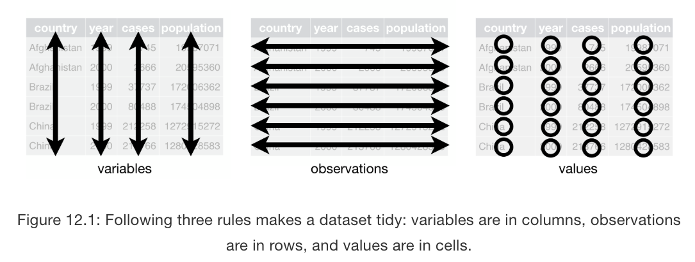
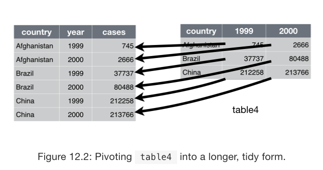
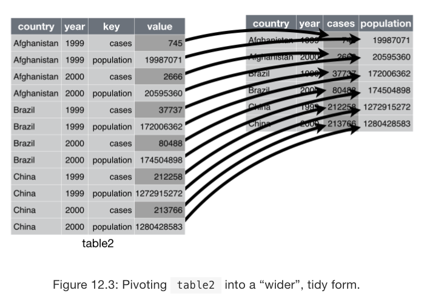
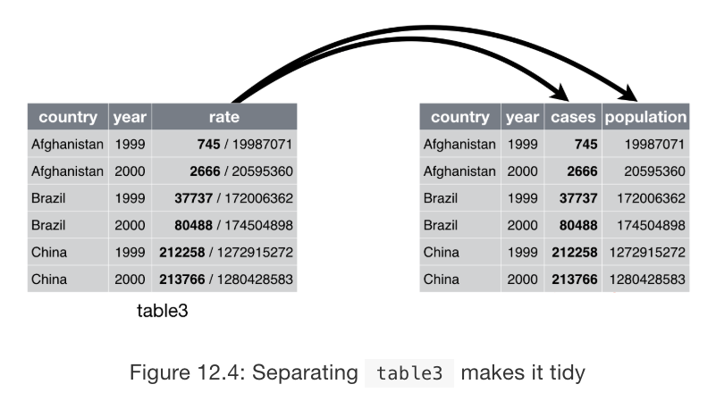
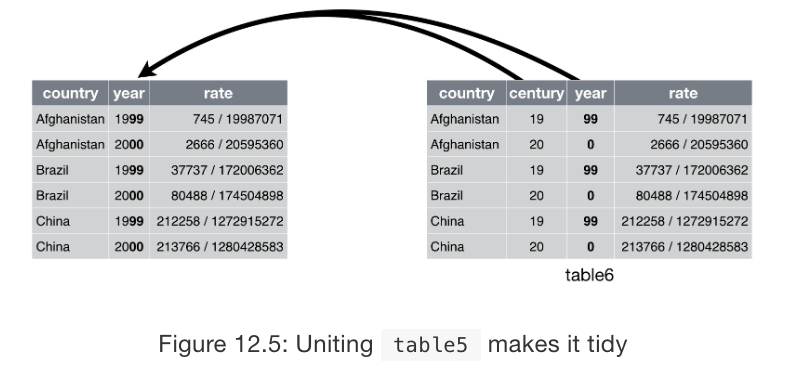

```{r setup, include=FALSE}
knitr::opts_chunk$set(echo = TRUE)
```

In Module 3, we are learning about "data wrangling", which is the process of getting data into `R` and into the right format for making graphs and doing statistical analyses.  In Content 3-2, we will learn about the principles of *tidy data* and functions that can be used to put data into this format.  We will use the `tidyr` package to do this.  The `tidyr` package is part of the `tidyverse`.

*Note:* These class activities are adapted from "R for Data Science" by Grolemund and Wickham, chapter 12.  You can find this chapter [here](https://r4ds.had.co.nz/tidy-data.html)

Load the `tidyverse` group of packages to have access to `tidyr`.
```{r}
library(tidyverse)
```

# Tidy data

The same data can be represented in many different formats.  Consider a data set which contains the number of tuberculosis (TB) cases documented by the World Health Organization (WHO) in Afghanistan, Brazil, and China for the years 1999 and 2000.  We could organize this data in four different ways:

* Table 1:

```{r}
table1
```

* Table 2:

```{r}
table2
```

* Table 3:

```{r}
table3
```

* Table 4 (really two tables, Table 4a and Table 4b):

```{r}
table4a  # data on cases
table4b # data on population
```

All of these tables contain the same underlying data, but some are easier to use (analyze, display) than others.  In general (although not absolutely always!) it is easiest to work with data that is in a **tidy** format.  Tidy data satisfies three rules:

1. Each variable must have its own column
2. Each observation must have its own row
3. Each value must have its own cell

Here's a visual representation of these rules from "R for Data Science" by Grolemund and Wickham, chapter 12:

```{r, echo=FALSE, fig.align='center', out.width="70%"}

```


We can summarize these three rules into an two easier rules: 

1. **PUT EACH DATASET INTO ITS OWN TIBBLE**
2. **WITHIN A DATASET, PUT EACH VARIABLE INTO ITS OWN COLUMN**

Which of the above four representations of the TB data would be considered tidy? 

Only **Table 1** would qualify as tidy data!

When data is in a tidy format, we can use the other functions/packages in the `tidyverse` easily:

* Calculate a disease rate per country per year:
```{r}
table1 %>%
  mutate(rate = cases/population*10000 )
```

* Calculate a total number of cases per year across the countries:
```{r}
table1 %>%
  group_by(year) %>%
  summarize(nCases = sum(cases))
```

* Graph changes over time by country:
```{r}
table1 %>%
  ggplot(mapping = aes(x = year, y = cases, color = country)) +
  geom_point() +
  geom_line()
```

## Practice

1. Can you calculate the disease rate per country per year (`rate` above) using the data in `table2`?
```{r}

```

2. Can you recreate the plot above showing change in cases over time using the data in `table2`? What do you need to do first?
```{r}

```


**Hopefully you can see that it is much harder to work with untidy data!**

## Common problems with untidy data

Two common problems with non-tidy data are:

1. One variable is spread across multiple columns
2. One observation is scattered across multiple rows

We can fix these problems using the `pivot_longer()` and `pivot_wider()` functions in `tidyr`.

# Making a dataset *longer*

Problem 1 (one variable is spread across multiple columns) can happen when some of the column names are not *names* of variables but *values* of variables instead:

```{r}
table4a
```

Here `1999` and `2000` are actually values of a `year` variable rather than variables themselves!  So each row of this dataset contains two observations instead of only one!

To make this dataset tidy, we need to **pivot** these columns into a new pair of variables where one gives the `year` of the observation and the other gives the `cases` of the observation. 

```{r}
table4a %>%
  pivot_longer( c(`1999`, `2000`), 
                names_to = "year", values_to = "cases")
```

The general format here is to first list the columns we want to pivot (`1999`, `2000`) and then give the names of the two new variables we want.  The `names_to` is the variable whose values formed the column names in the old data set and the `values_to` is the variable whose values were in the original columns.

Here's a visual representation from "R for Data Science" by Grolemund and Wickham, chapter 12:

```{r, echo=FALSE, fig.align='center', out.width="70%"}

```

You can see that the `pivot_longer()` function makes the dataset *longer* by increasing the number of rows in the dataset.  In this case, the number of columns stayed the same, but if we had had more than 2 years across the columns (like `1999`, `2000`, and `2001`) we would also have decreased the number of columns by creating only 2 new columns for `year` and `cases`.

## Practice

3. Why doesn't this code work?
```{r eval=FALSE}
table4a %>%
  pivot_longer( c(1999, 2000), 
                names_to = "year", values_to = "cases")
```

4. Use `pivot_longer()` to also put `table4b` in a tidy format.
```{r eval=FALSE}
table4b %>% 
  
```

5. Now we can then join `table4a` and `table4b` together using the `left_join()` function from the `dplyr` package.  Run this code to see the resulting tidy dataset that matches `table1`!
```{r}
tidy4a <- table4a %>%
  pivot_longer( c(`1999`, `2000`), 
                names_to = "year", values_to = "cases")
  
tidy4b <- table4b %>%
  pivot_longer( c(`1999`, `2000`), 
                names_to = "year", values_to = "population")

tidy4 <- left_join(tidy4a, tidy4b)
tidy4
```

# Making a dataset *wider*

Problem 2 (one observation is scattered across multiple rows) can happen when a column contains values for more than a single variable:

```{r}
table2
```

Here the `count` column contains values for both the number of cases *and* the population. 

To make this dataset tidy, we need to **pivot** this column into two columns instead, so that we will have a column for `cases` and a separate column for `population`. 

```{r}
table2 %>%
  pivot_wider(names_from = type, values_from = count)
```

The general format here is that `names_from` is the column that contains the names of the new variables we are creating and `values_from` is the column containing the values of these new variables. 

Notice that since these variables (`type` and `count`) already exist, we don't need to put their names in quotation marks like we did for `pivot_longer()`.  

Here's a visual representation from "R for Data Science" by Grolemund and Wickham, chapter 12:

```{r, echo=FALSE, fig.align='center', out.width="70%"}

```

You can see that the `pivot_wider()` function makes the dataset *wider* by increasing the number of columns and decreasing the number of rows in the dataset.

You hopefully also see that `pivot_longer()` and `pivot_wider()` are complements to each other; `pivot_longer()` makes wide tables narrower and longer and `pivot_wider()` makes long tables shorter and wider.

## Practice

6. Tidy the data below.  Do you need to use `pivot_longer()` or `pivot_wider()`?  What are the variables?

```{r}
preg <- tribble(
  ~pregnant, ~male, ~female,
  "yes",     NA,    10,
  "no",      20,    12
)

preg
```

7. Tidy the data below.  Do you need to use `pivot_longer()` or `pivot_wider()`?  What are the variables?

```{r}
characteristics <- tibble(
  name   = c("Ann","Ann","Barbara","Barbara"),
  measure  = c("age", "height",  "age", "height"),
  value = c(45, 67, 32, 60)
)

characteristics
```


# Separating and uniting

In addition to the two common problems discussed above, we can also have non-tidy data because:

1. A single cell contains two values
2. A single value is spread across multiple cells (pretty rare!)

We can fix these problems using the `separate()` and `unite()` functions in `tidyr`. 

## Splitting a cell with `separate()`

The `separate()` function pulls apart one column into multiple columns by splitting on a designated separator character:

```{r}
table3
```

For tidy data, we should separate the numerator and denominator of the `rate` variable into separate columns called `cases` and `population`.  We can use the character `/` to separate these two values.  We tell the function the names of the two new variables we want and the character that separates them:

```{r}
table3 %>% 
  separate(rate, into = c("cases", "population"), sep="/")
```

Here's a visual representation from "R for Data Science" by Grolemund and Wickham, chapter 12:

```{r, echo=FALSE, fig.align='center', out.width="70%"}

```

Now if we wanted to, we could create that quantitative `rate` variable in a more meaningful way using mutate!  But why won't this work?

```{r eval=FALSE}
table3 %>% 
  separate(rate, into = c("cases", "population"), sep="/") %>%
  mutate(rate = cases/population*10000)
```

It's because when we separated into `cases` and `population`, the two new variables it created were designated as characters instead of doubles!  You can see this by looking at the resulting tibble and seeing the `<chr>` under these two new columns:
```{r}
table3 %>% 
  separate(rate, into = c("cases", "population"), sep="/") 
```

How can we fix this?  We can use the `convert` option within `separate()` to have `R` attempt to convert the new columns it's creating to the appropriate type (like parsing when we learned about data import). We can try that here:

```{r}
table3 %>% 
  separate(rate, into = c("cases", "population"), sep="/", convert = TRUE) 

table3 %>% 
  separate(rate, into = c("cases", "population"), sep="/", convert = TRUE) %>%
  mutate(rate = cases/population*10000)
```

## Practice

8. What's the difference between these two chunks of code?
```{r}
table3 %>% 
  separate(rate, into = c("cases", "population"), sep="/")

table3 %>% 
  separate(rate, into = c("cases", "population"), 
           sep="/", 
           remove = FALSE)
```

9. Can you figure out what happens when we give `sep` a number instead of a character?

```{r}
table3 %>% 
  separate(year, into = c("century", "year"), sep = 2)

table3 %>% 
  separate(country, into = c("abbrev", "extra"), sep = 3)
```

## Combining cells with `unite()`

The inverse of `separate()` is `unite()`, which combines multiple columns into a single column.  This isn't a very common thing to do, but it's nice to know this tool exists!  For example, suppose we were starting with the data set where we split year into century and year:
```{r}
table_century <- table3 %>% 
  separate(year, into = c("century", "year"), sep=2)

table_century
```

But we wanted to combine these two columns back together into a single column:

```{r}
table_century %>% 
  unite(new, century, year, sep = "")
```

Here the `sep = ""` option means we want no space between the two columns when we put them together.  If we wanted a space or other character for some reason, we could use something else:
```{r}
table_century %>% 
  unite(new, century, year, sep = "...")
```

Here's a visual representation from "R for Data Science" by Grolemund and Wickham, chapter 12:

```{r, echo=FALSE, fig.align='center', out.width="70%"}

```

# Case study

Here's a more complicated example of tidying data in practice!  The following data contains TB data from the WHO broken down by country, year, age, gender, and diagnosis data.  This is a very messy dataset, but we can use the tools in the `tidyr` package to put it in tidy format!

```{r eval = FALSE}
who

View(who)
```

What variables do we see?

* `country`, `iso2`, and `iso3` all give the country
* `year` gives the year 
* A column like `new_sp_m014` must give us some information about the age, gender, and diagnosis. There is also a lot of missing data in these columns!

In fact, if we looked at the data dictionary (codebook) for this data set, we would learn that these variable names are coded in the following way:

* the first 3 letters of the variable name tell us whether these are new or old cases of TB
* the next 2 or 3 letters describe the type/diagnosis of TB (`rel` = relapse, `ep` = extrapulmonary, `sn` = smear negative, `sp` = smear positive)
* the sixth letter give the sex (`m` = males, `f` = females)
* the remaining numbers give the age group (`014` = 0-14 years old, etc)

This means these variable names contain values of variables, so we will need to use `pivot_longer` to move them into new variables!  We'll call this new variable `key` for now and move the values associated with this new variable `cases`.

We will also remove all the missing values at this point to make the data set easier to work with.  We can do this with the `values_drop_na = TRUE` option:
```{r}
who1 <- who %>% 
  pivot_longer(new_sp_m014:newrel_f65, 
               names_to = "key", 
               values_to = "cases", 
               values_drop_na = TRUE)
who1
```

Now we can see that this key column contains the values of multiple variables: `new`, `type`, `sex`, and `age`.  We can split across these values using the `pivot_wider()` function.  

One thing we need to fix first, though, is a typo in the names for the `rel` type.  The `_` symbol is missing so it reads `newrel_m014` instead of `new_rel_m014`.  We will fix that now before we proceed; this isn't something you would know how to do yet in our class:
```{r}
who1 %>%
  group_by(key) %>%
  summarize(n=n()) %>%
  as.data.frame()

who2 <- who1 %>% 
  mutate(key = stringr::str_replace(key, "newrel", "new_rel"))

who2
```

Now we can separate the `key` column across the `_` character to split into `new`, `type`, and `sex_age` columns:
```{r}
who3 <- who2 %>% 
  separate(key, into = c("new", "type", "sex_age"), sep = "_")
who3
```

Finally, we can separate the `sex_age` column into just `sex` and `age` by splitting after the first position:
```{r}
who4 <- who3 %>% 
  separate(sex_age, into = c("sex", "age"), sep = 1)
who4
```

Now we have tidy data!  Check that each variable has its own column, each observation has its own row, and each value has its own cell.

## Practice

10. We could do this whole process at once without saving the intermediate dataset using the pipe.  What would that look like? 
```{r}


```
